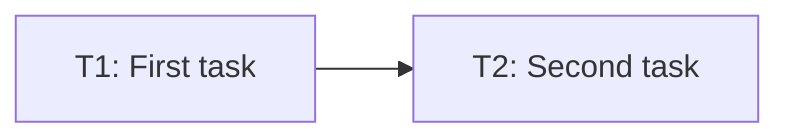

# Tasks: [Feature]

> Requirements: @requirements.md
> Design: @design.md
> Status: Draft
> Last Updated: YYYY-MM-DD

## Requirement Coverage

| Requirement | Tasks | Notes |
|-------------|-------|-------|
| FR-001 | T1, T2 | |
| NFR-001 | T3 | |

## Task Summary

| Task | Title | Priority | Estimate | Dependencies | Status |
|------|-------|----------|----------|--------------|--------|
| T1 | [Title] | P0 | 1h | none | pending |
| T2 | [Title] | P1 | 2h | T1 | pending |

## Dependency Diagram

## Task T1: [Title]

**Priority:** P0  
**Estimate:** [30m / 1h / 2h / 4h]  
**Dependencies:** none  
**Covers:** FR-001, NFR-001  
**Status:** pending

### Overview

[2-3 sentences: what this task accomplishes and why it matters.]

### Work

- [ ] [Subtask — WHAT to accomplish]
- [ ] [Subtask — WHAT to accomplish]

### Acceptance Criteria

- [ ] [Verifiable result]
- [ ] [Verifiable result]

### Files

- `path/to/file.tsx` — create/modify; [why]
- `path/to/test.tsx` — create/modify; [why]

### Verification

- [ ] Unit/component tests pass: `[command]`
- [ ] Integration/API tests pass: `[command or N/A]`
- [ ] Lint/typecheck passes: `[command]`
- [ ] Build passes: `[command]`
- [ ] Manual behavior checked: [scenario]

### Notes

- Reference `design.md` for implementation details. Do not duplicate design decisions here.

## Task T2: [Title]

**Priority:** P1  
**Estimate:** [30m / 1h / 2h / 4h]  
**Dependencies:** T1  
**Covers:** FR-002  
**Status:** pending

### Overview

[2-3 sentences.]

### Work

- [ ] [Subtask]

### Acceptance Criteria

- [ ] [Verifiable result]

### Files

- `path/to/file` — create/modify; [why]

### Verification

- [ ] [Verification]

## Completion Rules

- Do not mark a task complete without implementation and verification evidence.
- Do not create separate testing-only tasks unless the project is about test infrastructure.
- Tests and verification belong inside each implementation task.
- If a task reveals a requirements or design gap, stop and update the relevant artifact through the proper gate.
